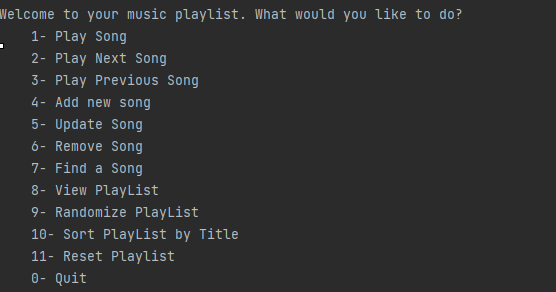
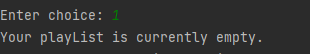
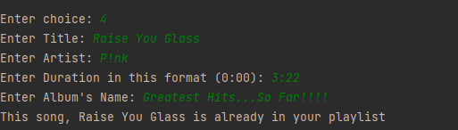
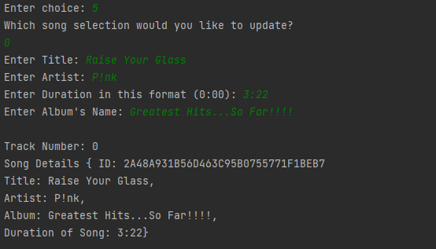
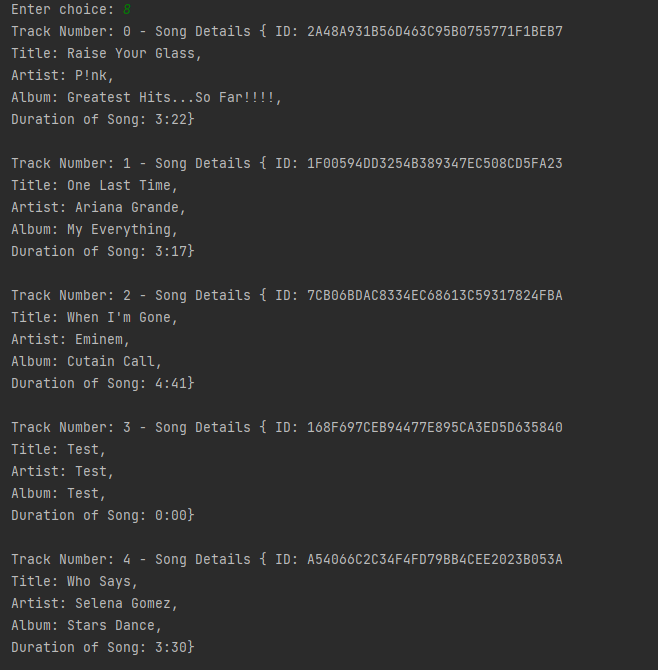
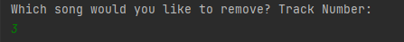
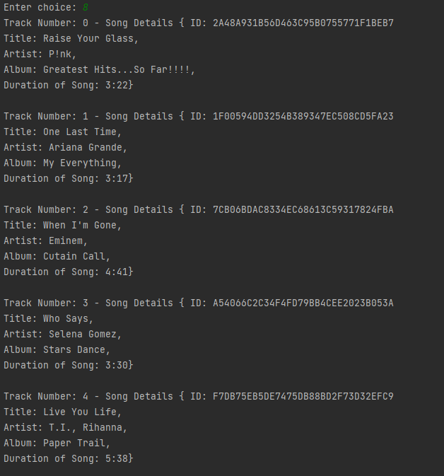
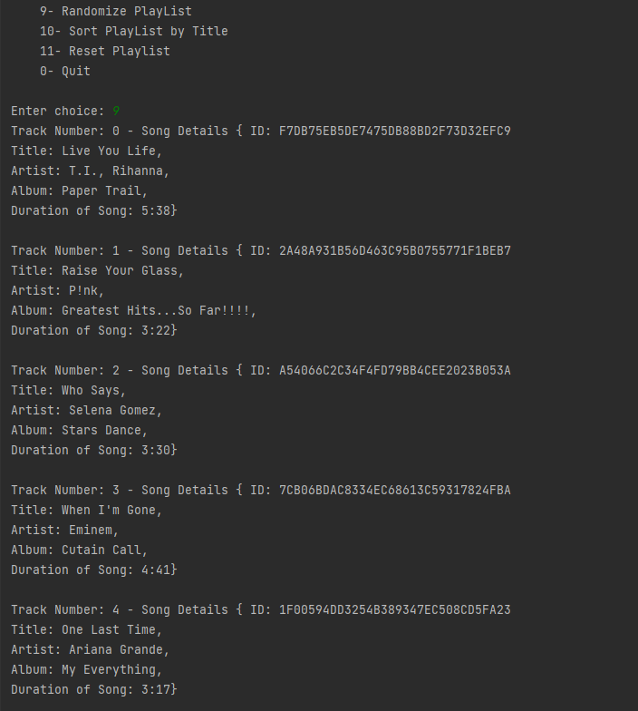
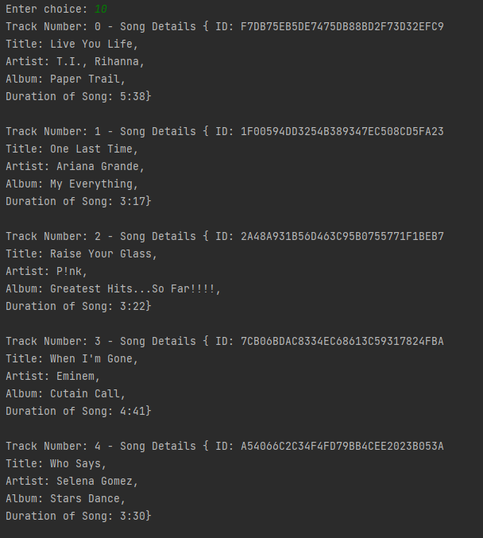

# Song Playlist
____________________
Song PlayList app that reviews Object oriented programing using Java and Java collections.

Features:  
* Add new song
* Update a song
* Retrieves a song's information 
* Removes a song from play list
* Shuffle Playlist  
* Sort playlist by song title's name
* Reset playlist
* Play current, next or previous song
____________________________________________________________
Images: 

Menu for users

Adding new Song

Updating Song 

Remove a Song 

Show Playlist after removal of song

Shuffle Playlist 

Sort Playlist by Title's name

